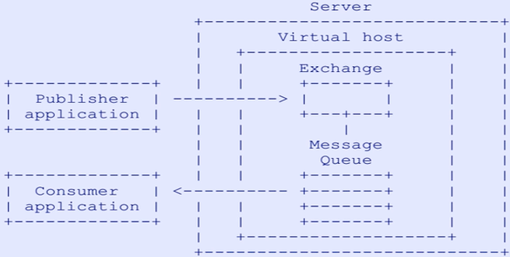
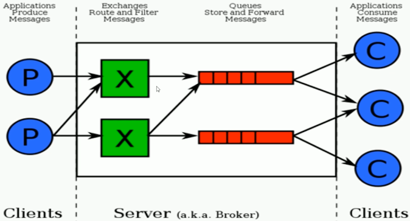
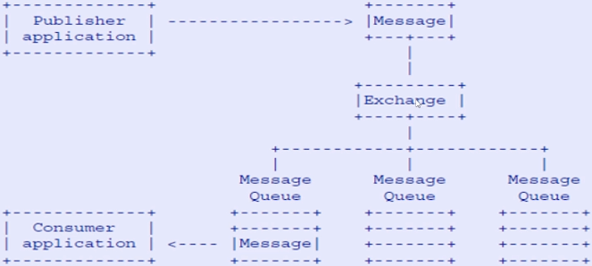
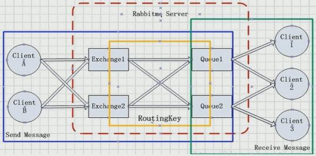
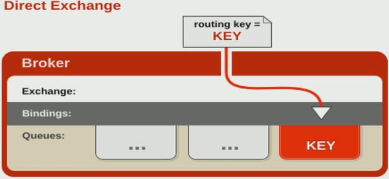
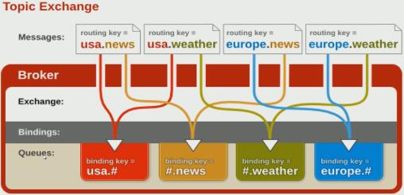

# RabbitMQ核心概念

## 什么是AMQP高级协议？

AMQP，即Advanced Message Queuing Protocol,一个提供统一消息服务的应用层标准高级消息队列协议,是应用层协议的一个开放标准,为面向消息的中间件设计。基于此协议的客户端与消息中间件可传递消息，并不受客户端/中间件不同产品，不同的开发语言等条件的限制。Erlang 中的实现有 RabbitMQ等。

## AMQP核心概念

AMQP模型（AMQP Model）：一个由关键实体和语义表示的逻辑框架，遵从AMQP规范的服务器必须提供这些实体和语义。为了实现本规范中定义的语义，客户端可以发送命令来控制AMQP服务器。
**Connection**：连接，一个网络连接，比如TCP/IP套接字连接。
**Channel**：网络信道，多路复用连接中的一条独立的双向数据流通道，几乎所有的操作都在Channel中进行，Channel是进行消息读写的通道。客户端可建立多个Channel，每个Channel代表一个会话任务。
**Message**：消息，服务器和应用程序之间传送的数据，由Properties和Body组成。Properties可对消息进行修饰，比如消息的优先级、延迟等高级特性；Body则是消息体内容。
Client：客户端，AMQP连接或者会话的发起者。AMQP是非对称的，客户端生产和消费消息，服务器存储和路由这些消息。
Server：服务器，又称为Broker，接受客户端连接，实现AMQP消息队列和路由功能的进程。也称为“消息代理”。
Peer：端点，AMQP对话的任意一方。一个AMQP连接包括两个端点（一个是客户端，一个是服务器）。
Partner：搭档，当描述两个端点之间的交互过程时，使用术语“搭档”来表示“另一个”端点的简记法。比如我们定义端点A和端点B，当它们进行通信时，端点B是端点A的搭档，端点A是端点B的搭档。
Assembly：片段集，段的有序集合，形成一个逻辑工作单元。
Segment：段，帧的有序集合，形成片段集中一个完整子单元。
Frame：帧，AMQP传输的一个原子单元。一个帧是一个段中的任意分片。
Control：控制，单向指令，AMQP规范假设这些指令的传输是不可靠的。
Command：命令，需要确认的指令，AMQP规范规定这些指令的传输是可靠的。
Exception：异常，在执行一个或者多个命令时可能发生的错误状态。
Class：类，一批用来描述某种特定功能的AMQP命令或者控制。
Header：消息头，描述消息数据属性的一种特殊段。
Body：消息体，包含应用程序数据的一种特殊段。消息体段对于服务器来说完全透明——服务器不能查看或者修改消息体。
Content：消息内容，包含在消息体段中的的消息数据。
**Exchange**：交换器，服务器中的实体，用来接收生产者发送的消息，并根据路由键将这些消息路由(转发)给绑定的队列。
Exchange Type：交换器类型，基于不同路由语义的交换器类。
Message Queue：消息队列，一个命名实体，用来保存消息直到发送给消费者。
**Binding**：绑定器，Exchange和Queue之间的虚拟连接，binding中可以包含routing key。
Binding Key：绑定器关键字，绑定的名称。一些交换器类型可能使用这个名称作为定义绑定器路由行为的模式。
**Routing Key**：路由关键字，一个路由规则，即一个消息头，交换器可以用这个消息头确定如何路由某条消息。
Durable：持久存储，一种服务器资源，当服务器重启时，保存的消息数据不会丢失。
Transient：临时存储，一种服务器资源，当服务器重启时，保存的消息数据会丢失。
Persistent：持久化，服务器将消息保存在可靠磁盘存储中，当服务器重启时，消息不会丢失。
Non-Persistent：非持久化，服务器将消息保存在内存中，当服务器重启时，消息可能丢失。
Consumer：消费者，一个从消息队列中请求消息的客户端应用程序。
Producer：生产者，一个向交换器发布消息的客户端应用程序。
**Virtual Host**：虚拟主机，用于进行逻辑隔离，最上层的消息路由。一批交换器、消息队列和相关对象。虚拟主机是共享相同的身份认证和加密环境的独立服务器域。客户端应用程序在登录到服务器之后，可以选择一个虚拟主机。一个Virtual Host里可有若干个Exchange和Queue，同一个Virtual Host里面不能有相同名称的Exchange或Queue。

## 什么是RabbitMQ

RabbitMQ是一个开源的消息代理和队列服务器，用来通过普通协议在完全不同的应用之间共享数据，RabbitMQ是使用Erlang语言编写的，并且RabbitMQ是基于AMQP协议的。

Erlang语言最初在于交换机领域的架构模式，这样使得RabbitMQ在Broker之间进行数据交互的性能是非常优秀的。

Erlang 的优点：Erlang有着和原生Socket一样的延迟。

## RabbitMQ整体架构模型

此图说明以下几点：

* 生产者只需关注把消息投递到指定的交换器exchange即可，消费者只需要监听指定的队列queue即可。

* 生成者不需要关心消息投递到哪个队列，而消费者也不需要关注消息从哪个exchange上来的。

* exchange和queue之间通过绑定关系流转消息，而producer和consumer之间实现了解耦。

## RabbitMQ消息如何流转的？

此图说明：

一个exchange可以绑定多个queue，通过路由策略routing key，把消息转给某个queue。

发消息时要指定两个关键点：1.消息要发到哪个exchange上；2.发消息时要带上routing key。消息通过exchange与queue之间的绑定关系发送到特定的queue，然后消费者只需监听特定的队列即可接收消息，进行消费。

## RabbitMQ安装与使用

源码安装准备：
yum install 
build-essential openssl openssl-devel unixODBC unixODBC-devel 
make gcc gcc-c++ kernel-devel m4 ncurses-devel tk tc xz

RPM包下载：
wget www.rabbitmq.com/releases/erlang/erlang-18.3-1.el7.centos.x86_64.rpm
wget http://repo.iotti.biz/CentOS/7/x86_64/socat-1.7.3.2-5.el7.lux.x86_64.rpm
wget www.rabbitmq.com/releases/rabbitmq-server/v3.6.5/rabbitmq-server-3.6.5-1.noarch.rpm

RPM安装方式：

rpm -ivh erlang-18.3-1.el7.centos.x86_64.rpm
rpm -ivh socat-1.7.3.2-1.1.el7.x86_64.rpm
rpm -ivh rabbitmq-server-3.6.5-1.noarch.rpm

配置文件：
vim /usr/lib/rabbitmq/lib/rabbitmq_server-3.6.5/ebin/rabbit.app
比如修改密码、配置等等，例如：loopback_users 中的 <<"guest">>,只保留guest

服务启动和停止：

* 启动 rabbitmq-server start &
  * ps -ef| grep rabbit
  * netstat -antlp| grep 5672
  * lsof -i:5672

* 停止 rabbitmqctl stop_app

* 管理插件：
  * rabbitmq-plugins list
  * rabbitmq-plugins enable rabbitmq_management

* 访问地址：http://192.168.0.70:15672/

## 命令行与管控台

### 基础操作

> **rabbitmqctl 启停服务**

* rabbitmqctl start_app		启动应用
* rabbitmqctl stop_app          关闭应用
* rabbitmqctl status                节点状态

> **rabbitmqctl 用户管理**

* rabbitmqctl add_user \<username> \<password>
* rabbitmqctl delete_user \<username>
* rabbitmqctl change_password \<username> \<newpassword>
* rabbitmqctl clear_password \<username>
* rabbitmqctl authenticate_user \<username> \<password>
* rabbitmqctl set_user_tags \<username> \<tag> ...
* rabbitmqctl list_users
* rabbitmqctl set_permissions [-p \<vhost>] \<user> \<conf> \<write> \<read>
* rabbitmqctl clear_permissions [-p \<vhost>] \<username>
* rabbitmqctl list_user_permissions \<username>

> **rabbitmqctl 管理虚拟主机**

* rabbitmqctl add_vhost \<vhost>
* rabbitmqctl delete_vhost \<vhost>
* rabbitmqctl list_vhosts [\<vhostinfoitem> ...]

> **rabbitmqctl 管理队列**

* rabbitmqctl sync_queue [-p \<vhost>] queue
* rabbitmqctl cancel_sync_queue [-p \<vhost>] queue
* rabbitmqctl purge_queue [-p \<vhost>] queue
* rabbitmqctl list_queues [-p \<vhost>]

### 高级操作

* rabbitmqctl join_cluster \<clusternode> [--ram]
* rabbitmqctl cluster_status
* rabbitmqctl change_cluster_node_type disc | ram
* rabbitmqctl forget_cluster_node [--offline]
* rabbitmqctl rename_cluster_node oldnode1 newnode1 [oldnode2]\[newnode2 ...]
* rabbitmqctl update_cluster_nodes clusternode
* rabbitmqctl set_cluster_name name

## RabbitMQ消息生产与消费

> 急速体验

ConnectionFactory：获取连接工厂

Connection：一个连接

Channel：数据通信信道，可发送和接收消息

Queue：具体的消息存储队列

Producer和Consumer：生成和消费者

## RabbitMQ交换机详解

* **Exchange**：接收消息，并根据路由键转发消息所绑定的队列

  

> **交换机属性**

* **Name**：交换机名称

* **Type**：交换机类型direct、topic、fanout、headers

* **Durability**：是否需要持久化，true为持久化

* **AutoDelete**：当最后一个绑定到Exchange上的队列删除后，自动删除该Exchange

* **Internal**：当前Exchange是否用于RabbitMQ内部使用，默认为False

* **Arguments**：扩展参数，用于扩展AMQP协议自己定制化使用

> **Direct Exchange**

* 所有发送到Direct Exchange的消息被转发到RouteKey中指定的Queue

**注意：Direct模式可以使用RabbitMQ自带的Exchange：defaultExchange，所以不需要将Exchange进行任何绑定(binding)操作，消息传递时，RouteKey必须完全匹配才会被队列接收，否则该消息会被抛弃。**

> **Topic Exchange**

* 所有发送到Topic Exchange的消息被转发到所有关心RouteKey中指定Topic的Queue上

* Exchange将RouteKey和某Topic进行模糊匹配，此时队列需要绑定一个Topic

  注意：可以使用通配符进行模糊匹配

  符号"#"匹配一个或多个词

  符号“*”匹配不多不少一个词

  例如：“log.#” 能匹配到“log.info.oa”

  ​            "log.*" 只会匹配到“log.error”

## RabbitMQ队列、绑定、虚拟主机、消息

# RabbitMQ高级特性

# RabbitMQ与Spring家族整合

# 构建RabbitMQ集群

# RabbitMQ SET化架构衍化与设计

# RabbitMQ基础组件封装思路